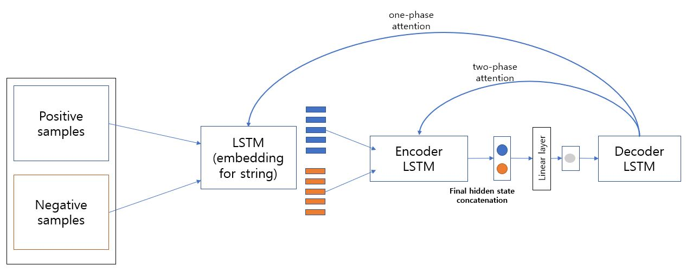

## Model architecture

## Result

- unidirectional model

|   |string equal|dfa equal|membership equal|total|
|------|---|---|---|---|
|star0|테스트2|테스트3|c|c|
|star1|테스트2|테스트3|c|c|
|star2|테스트2|테스트3|c|c|
|star3|테스트2|테스트3|c|c|

- bidirectional model

|   |string equal|dfa equal|membership equal|total|
|------|---|---|---|---|
|star0|테스트2|테스트3|c|c|
|star1|테스트2|테스트3|c|c|
|star2|테스트2|테스트3|c|c|
|star3|테스트2|테스트3|c|c|

- bidirectional + attention(only positive samples)

|   |string equal|dfa equal|membership equal|total|
|------|---|---|---|---|
|star0|테스트2|테스트3|c|c|
|star1|테스트2|테스트3|c|c|
|star2|테스트2|테스트3|c|c|
|star3|테스트2|테스트3|c|c|

- bidirectional + attention(both positive and negative samples)

|   |string equal|dfa equal|membership equal|total|
|------|---|---|---|---|
|star0|994|1||c|
|star1|테스트2|테스트3|c|c|
|star2|테스트2|테스트3|c|c|
|star3|테스트2|테스트3|c|c|
